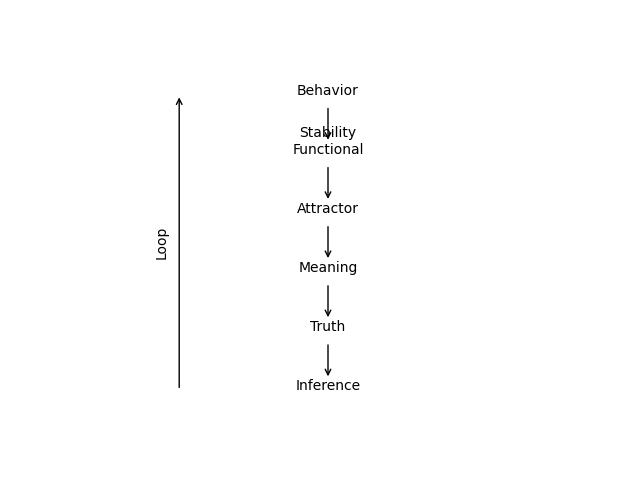
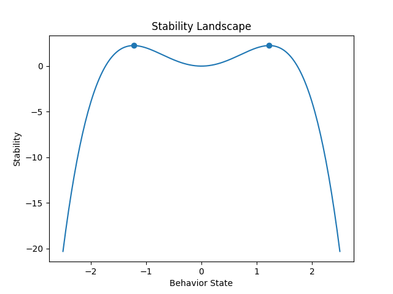
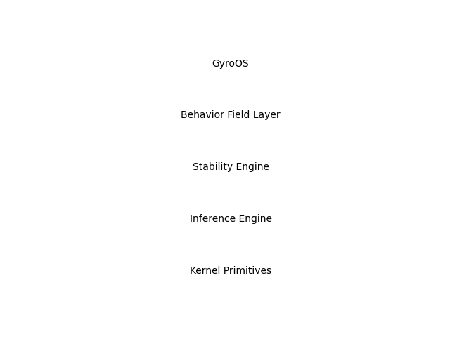

# GyroOS / Gyro Logic

A logic and operating system framework based on **behavior dynamics and
stability**.

------------------------------------------------------------------------

## Overview

Gyro Logic is a formal framework in which:

-   Meaning emerges as **stabilized behavior**
-   Truth is defined as a **stability-weighted projection**
-   Inference is formulated as **stability optimization**

This repository presents the core theory, formal system, and system
architecture of GyroOS.

------------------------------------------------------------------------

## Motivation

Classical logic treats truth as static and context-independent.

However, real-world systems exhibit:

-   Context-dependent reasoning\
-   Goal-oriented decision making\
-   Dynamic interaction between agents

Gyro Logic models these phenomena using a unified stability-based
formulation.

------------------------------------------------------------------------

## Core Structure

------------------------------------------------------------------------

## Stability Landscape

------------------------------------------------------------------------

## GyroOS Architecture

------------------------------------------------------------------------

## Formal Definition

Behavior: \[ `\mathcal{B}`{=tex} : `\mathbb{T}`{=tex}
`\rightarrow `{=tex}`\mathcal{M}`{=tex} \]

Stability: \[ `\mathcal{L}`{=tex}\_{stab} = `\alpha `{=tex}C -
`\beta `{=tex}D - `\gamma `{=tex}I + `\delta `{=tex}R \]

Truth: \[
T(t;F)=`\Pi`{=tex}(`\mathcal{B}`{=tex},F,t)`\cdot`{=tex}`\Sigma`{=tex}(`\mathcal{B}`{=tex},F,t)
\]

Attractor: \[ `\mathcal{A}`{=tex}*F =
`\arg`{=tex}`\max `{=tex}`\mathcal{L}`{=tex}*{stab} \]

Dynamics: \[ `\frac{d\mathcal{B}}{dt}`{=tex} =
`\nabla `{=tex}`\mathcal{L}`{=tex}\_{stab} \]

------------------------------------------------------------------------

## Key Concepts

-   Behavior Field\
-   Stability Functional\
-   Frame-dependent Truth\
-   Attractor as Meaning Core\
-   Inference as Dynamic Transformation

------------------------------------------------------------------------

## GyroOS

GyroOS is an operating system architecture derived from Gyro Logic.

-   Fileless\
-   Relation-native\
-   Behavior-driven\
-   Self-organizing

------------------------------------------------------------------------

## Status

-   [x] Formal System v1.0\
-   [x] Stability Theory\
-   [x] Attractor Theory\
-   [x] Core Diagrams\
-   [ ] Prototype Expansion\
-   [ ] arXiv Submission

------------------------------------------------------------------------

## Publication

Zenodo release (DOI) --- coming soon\
arXiv submission --- in preparation

------------------------------------------------------------------------

## Vision

A foundation for:

-   AI reasoning\
-   Multi-agent systems\
-   Dynamic knowledge representation\
-   Post-symbolic computation
