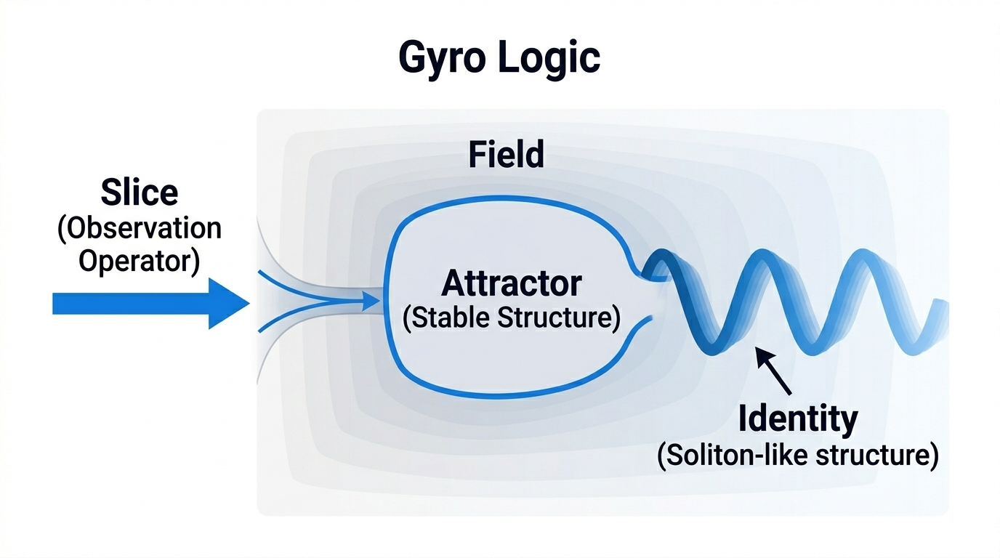
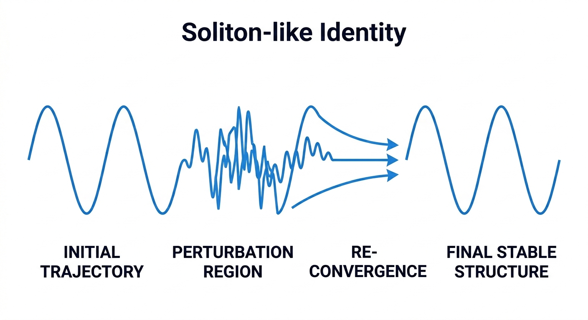
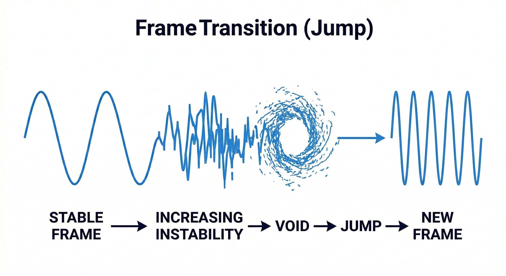

# Gyro Logic

Based on Gyro Logic v2.0

System and computational architecture built on Gyro Logic.
For the formal theory, see gyrologic.
For authentication application, see GyroAuth.

## Position

GyroOS is the system-level realization of Gyro Logic.

The formal theoretical foundation is defined in:
https://github.com/gitGyro-Dev/gyrologic

GyroOS focuses on translating:

- structure → data models
- observation → system interfaces
- stability → scoring engines
- identity → state tracking

into executable systems.

## 🧠 Theoretical Foundation

This project is based on **Gyro Logic v2.0**:

https://doi.org/10.5281/zenodo.19555020

Gyro Logic defines:

- Identity as stability  
- Observation as operator (Slice)  
- Structure as emergent from dynamic systems  

This repository represents the **implementation layer** of that theory.

Gyro Logic is a theoretical framework for modeling identity, meaning, and truth as emergent properties of stability under dynamic observation.

Unlike conventional logical or identity systems, Gyro Logic treats observation as an active operator, identity as a preserved dynamic structure, and truth as stability under observation.

---

## Overview

Gyro Logic models reality as a dynamic **Field**.  
Observation acts as a **Slice operator**, transforming the Field and revealing stable structures.

This process defines:

- how structure emerges from observation
- how stability defines meaning
- how identity forms as a persistent dynamic pattern

---

## Identity as Soliton-like Structure

Identity is not a static label, but a dynamic structure that survives perturbation and repeated observation.

A soliton-like identity:

- maintains structural coherence
- preserves phase structure
- re-converges after disturbance

Such structures represent robust identity under Gyro Logic.

---

## Frame Transition (Jump)

When instability increases beyond the capacity of the current Frame, a transition occurs.

This transition involves:

- loss of stability in the current Frame
- expansion of Void (non-stabilizable region)
- irreversible Jump
- emergence of a new stable Frame

This mechanism explains structural transformation and identity change.

---

## Core Concepts

- **Field**: Dynamic representation of reality  
- **Slice**: Observation operator acting on the Field  
- **Stability**: Structural invariance under repeated observation  
- **Identity**: Preserved dynamic structure (soliton-like)  
- **Void**: Region where stable structures cannot form  
- **Jump**: Transition between Frames  

---

## Documentation

- Overview → `docs/01_overview.md`
- Field & Slice → `docs/02_field_and_slice.md`
- Stability & Convergence → `docs/03_stability_and_convergence.md`
- Identity & Soliton → `docs/04_identity_and_soliton.md`
- Frame & Jump → `docs/05_frame_and_jump.md`
- Void & Instability → `docs/06_void_and_instability.md`
- Operator Formalism → `docs/07_operator_formalism.md`
- GyroAuth Connection → `docs/08_gyroauth_connection.md`

---

## Applications

- GyroAuth: convergence-based authentication
- AI behavior and identity modeling
- Stability-based reasoning systems
- Dynamic systems and cognitive models

---

## Version

**Gyro Logic v2.0**