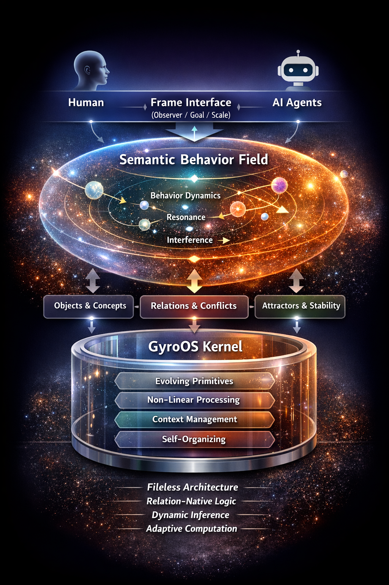

# Gyro Logic / GyroOS

**A Geometric, Behavior-Based Logic and a Next-Generation Operating System**

---

## 🧭 Overview

Gyro Logic is a formal system where:

* Meaning = behavior
* Truth = slice of behavior
* Conflict = interference
* Logic = evolution of semantic fields

[
\frac{d\mathcal{B}}{dt}
=======================

## \Phi(\mathcal{B})

\nabla \mathcal{L}_{stab}
+
\mathcal{I}(\mathcal{B})
]

---

## 🌌 Core Concept

> Logic is not static.
> It is dynamic, contextual, and evolving.

---

## 🧠 Gyro Logic

### Core Components

* **Behavior**: evolving semantic trajectory
* **Frame**: observer / goal / time / scale
* **Interference**: structured interaction (including conflict)
* **Stability**: attractor-based structure

---

## 🔺 Key Shift

| Classical Logic  | Gyro Logic                         |
| ---------------- | ---------------------------------- |
| Truth = value    | Truth = behavior slice             |
| Logic = rules    | Logic = dynamics                   |
| Conflict = error | Conflict = structured interference |

---

## 📄 Research Position

Preprint-style formal system and prototype for a new behavior-based logic.
This work is being prepared for arXiv submission.

---

## 💻 GyroOS

GyroOS is the computational embodiment of Gyro Logic.

### Features

* Fileless architecture
* Relation-native data model
* Behavior-based computation
* Multi-agent reasoning
* Self-reorganizing system

---

## 🧩 Architecture



```text
Human / AI
   ↓
Frame Interface
   ↓
Semantic Behavior Field
   ↓
Object / Relation / Interference
   ↓
Kernel Primitives
```

---

## 📚 Documentation

👉 Full theory and system design are available in the `/docs` directory.

### 🧠 Gyro Logic (Theory)

* [Overview](docs/gyro_logic/00_overview.md)
* [Formal System v1.0](docs/gyro_logic/01_formal_system.md)
* Geometry *(coming soon)*
* Algebra *(coming soon)*
* Stability & Attractor Theory *(coming soon)*

---

### 💻 GyroOS (System Design)

* [Architecture](docs/gyroos/01_architecture.md)
* Kernel *(coming soon)*
* Object Model *(coming soon)*
* VM / Execution Model *(coming soon)*
* Prototype *(coming soon)*

---

### 🖼️ Visual Models

* GyroOS Architecture *(included)*
* Behavior Geometry *(coming soon)*
* Inference Flow *(coming soon)*

---

## 🚀 Quick Start

```bash
pip install streamlit networkx matplotlib
streamlit run app.py
```

---

## 📁 Repository Structure

```text
gyroos/
├── README.md
├── docs/
│   ├── gyro_logic/
│   ├── gyroos/
│   ├── diagrams/
│   └── pitch/
└── archive/
```

---

## 🔬 Status

Research Prototype / Active Development

---

## ✨ Final Statement

> Thinking becomes manipulable.
