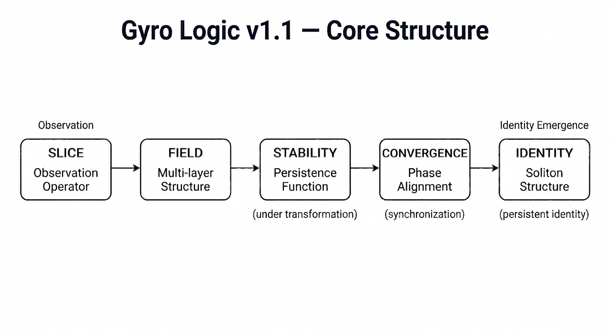
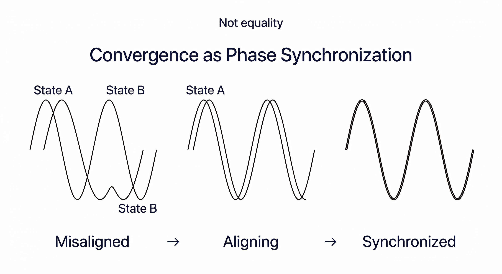
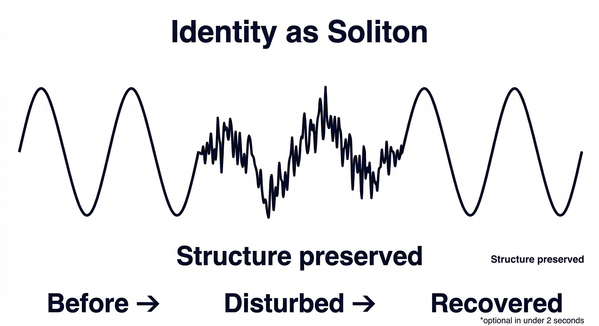
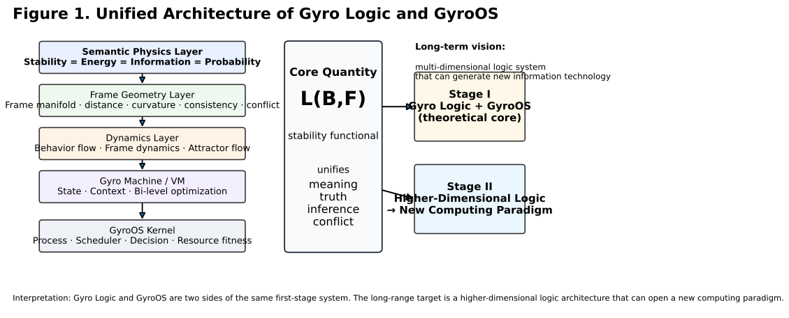
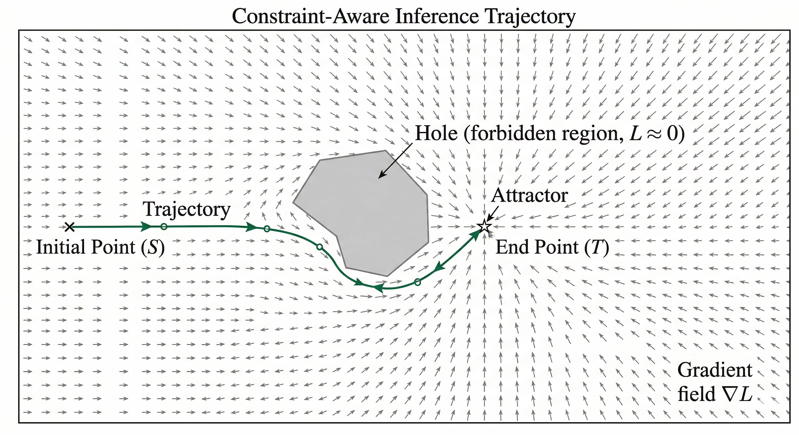
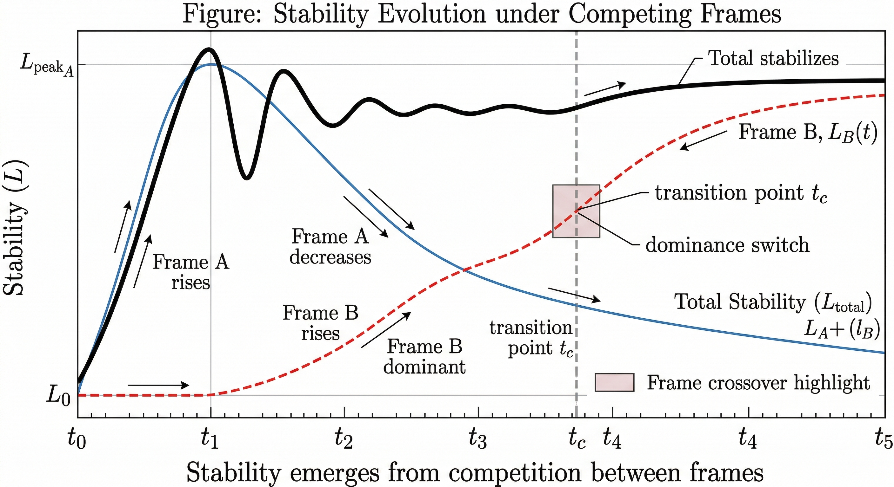
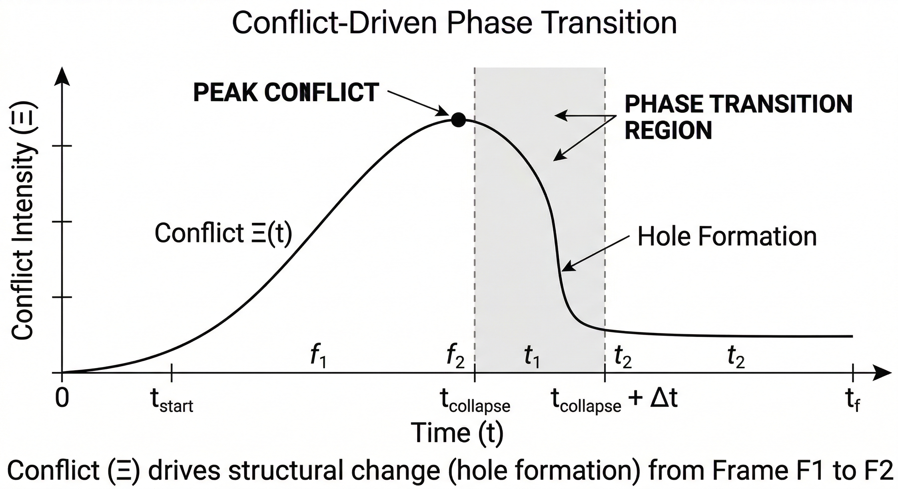

# 🌀 GyroOS / Gyro Logic

> Computation is not a function.
> It is a trajectory shaped by competing frames.

---

## 🎥 What is Gyro Logic?

---

## ⚡ Why this is different

### Traditional Computing

Input → Function → Output

### Gyro Computing

State → Dynamics → Attractor

---

### Traditional AI

* Single model
* Fixed interpretation
* Static inference

### Gyro Logic

* Multiple competing frames
* Dynamic interpretation
* Trajectory-based inference

---

## 🧠 Core Idea

Meaning   = stabilized behavior
Truth     = stability-weighted projection
Inference = trajectory toward attractor
Conflict  = interference between frames

---

## 🧩 Core Structure (v1.1)

Gyro Logic v1.1 defines the minimal stable core:

Slice → Field → Stability → Convergence → Identity

---

### ⚖️ Stability

Stability measures persistence under transformation.

* Meaning = stabilized behavior
* Truth = stable projection
* Robust across observation slices

---

### 🔁 Convergence (Phase Synchronization)

Convergence is not equality.

It is alignment in phase space.

---

### 🧬 Identity (Soliton)

Identity is not static.

It is a structure that persists under disturbance.

---

### 🔐 GyroAuth Connection

Authentication is not identity verification.

→ convergence of states across:

* Time
* Space
* Device
* Motion

Identity emerges through consistent convergence.

---

## 🔥 Core Equations

dB/dt = ∇_B L(B,F)
dF/dt = ∇_F L(B,F) - λ∇_F Ξ

---

## 📐 Research Figures

### Figure 1 — Unified Architecture

### Figure 2 — Mathematical Structure

### Figure 3 — Inference Dynamics

### Figure 4 — Conflict Geometry

> Conflict is not an error.
> It is curvature in frame space.

---

## 🕳 Hole / Void (Key Concept)

A "hole" is not an object.

It is a region that cannot be occupied under stability dynamics.

### Definition

* **Hole**: bounded region of zero stability enclosed by stable regions
* **Void**: globally unreachable region across all frames

### Interpretation

* Objects = stable regions
* Holes = locally forbidden regions
* Void = globally forbidden regions

### Figure 5 — Hole Structure in Stability Space

---

## 🔄 Phase Transition (Hole Formation)

### Figure 6 — Hole Formation (Mathematical)

### Figure 6b — Phase Transition (Before / After)

---

## 🔬 Conflict Visualization (Figure 7–9)

### Figure 7 — Inference Trajectory

### Figure 8 — Stability Evolution

### Figure 9 — Conflict Phase Transition

---

## 🧠 Why these figures matter

Inference = constrained motion in a dynamically reshaped stability landscape

---

## 🧩 Paradox Series

* [Paradox Index](docs/paradox/index.md)

---

## v1.2 — Paradox Integration Layer

Paradoxes are reformulated as:

* Stability breakdown
* Frame conflict
* Absence of stable attractors

See: `docs/paradox_layer_v1_2.md`

---

## ⚙️ Demos

python gyro_demo_v2.py
python gyro_conflict_demo.py

---

## 🧩 System Mapping

| Concept   | Role         |
| --------- | ------------ |
| Behavior  | State        |
| Frame     | Perspective  |
| Stability | Objective    |
| Conflict  | Interference |
| Inference | Trajectory   |

---

## 🚧 Roadmap

See full roadmap:

👉 [Gyro Logic Roadmap](./Roadmap.md)

---

## 🌌 Vision

GyroOS is:

→ A Meaning-Centric Operating System
→ A Multi-Dimensional Logic Engine
→ A New Computational Paradigm

---

## 🧨 Core Claim

Computation = Stability Optimization
Logic = Geometry of Stability
Intelligence = Motion in Frame Space

---

## 🔁 Spin-off Projects

### 🔐 GyroAuth

https://github.com/gitGyro-Dev/gyroauth

Identity = multi-dimensional state convergence

---

## 📄 Citation

DOI: https://doi.org/10.5281/zenodo.19428071

---

## 👤 Author

kawakami
