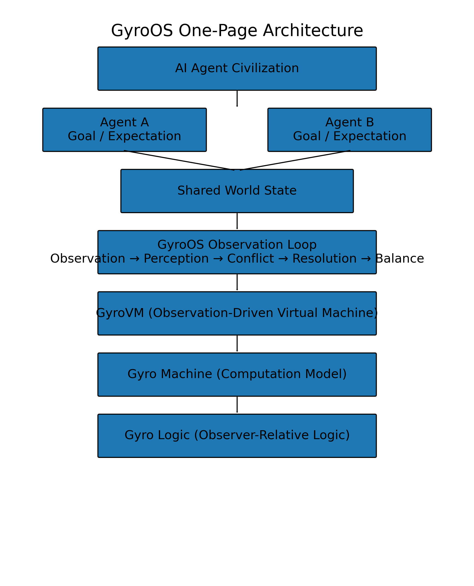
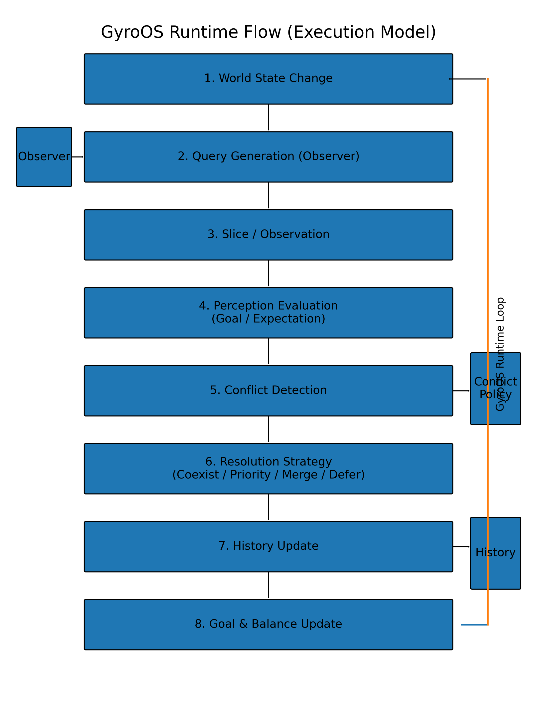
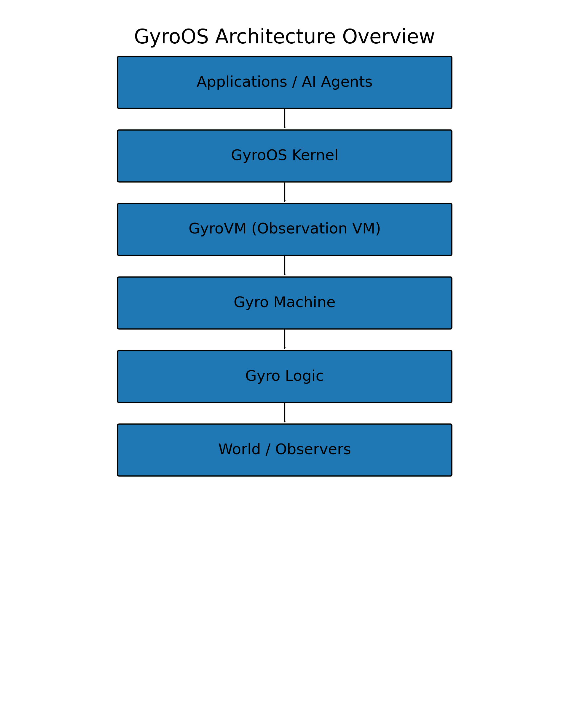
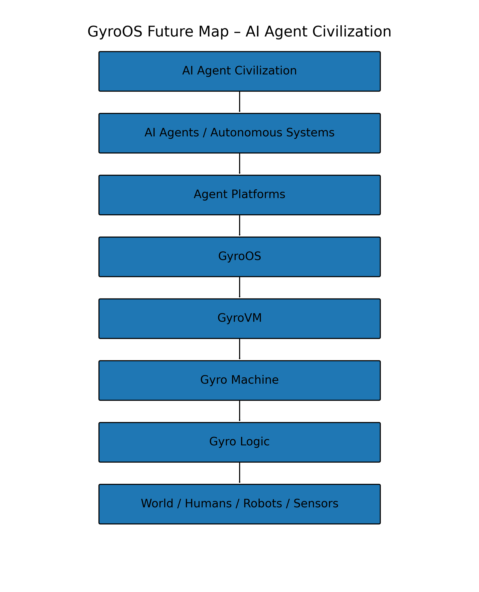
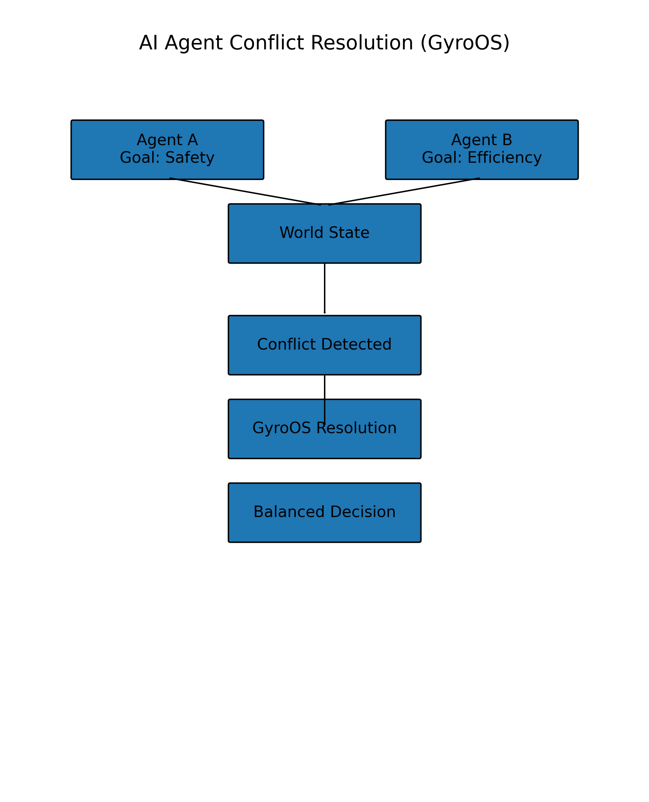
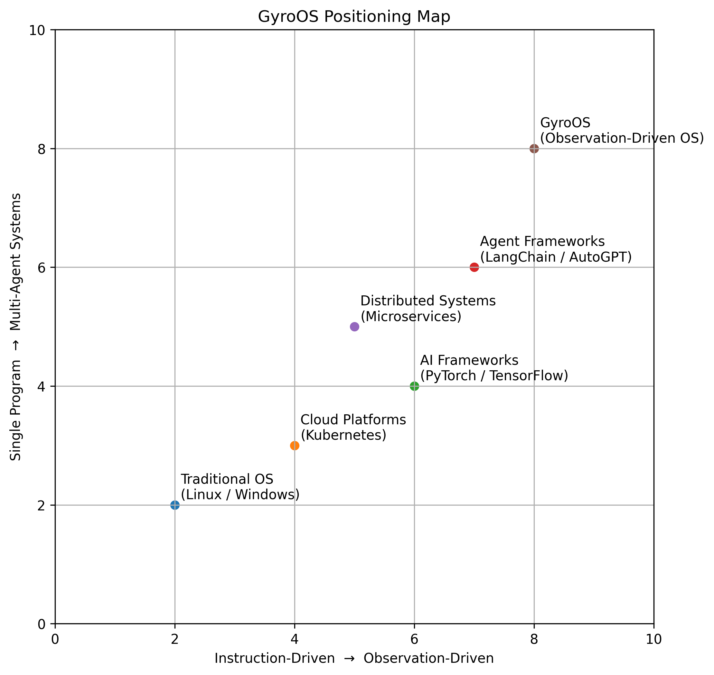
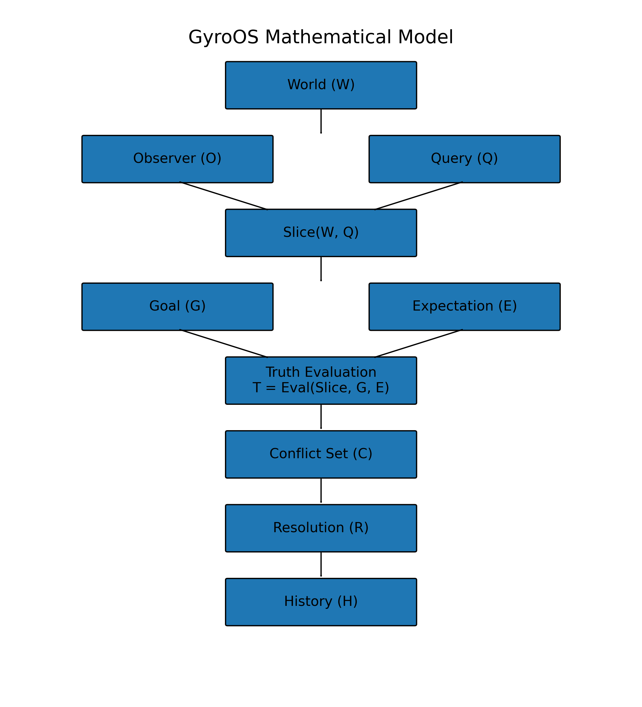
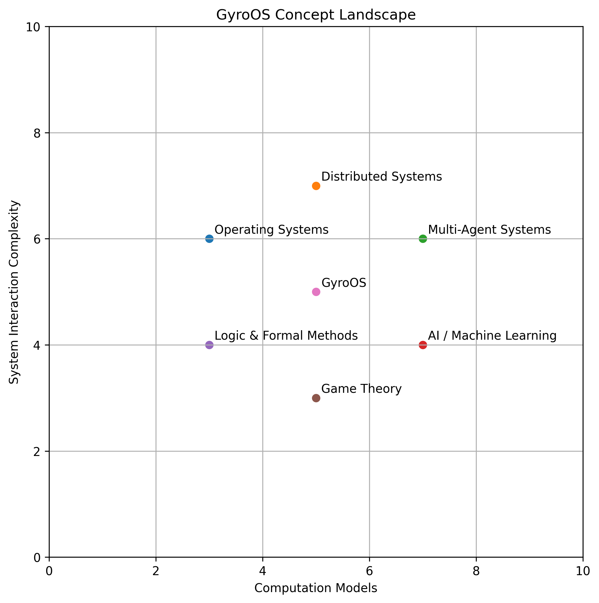

# GyroOS

Observation-Driven Operating System for AI Agent Systems

GyroOS is a research project exploring a new operating system architecture
for multi-agent AI environments.

Instead of instruction-driven computation, GyroOS proposes
an **observation-driven computing model** based on:

- observation
- perception
- conflict detection
- resolution
- history
- balance

## GyroOS Runtime Flow

## Architecture Overview

## Positioning

## Mathematical Model

## Concept Landscape

# GyroOS

**Observation-Driven Operating System for AI Agent Systems**

GyroOS is a research project exploring a new operating system architecture designed for **AI agent ecosystems and multi-agent environments**.

Instead of traditional instruction-driven computation, GyroOS introduces an **observation-driven computation model** based on:

- observation
- perception
- conflict detection
- resolution
- history
- balance

GyroOS explores a new computing foundation for the emerging **AI Agent Civilization**.

---

# Motivation

Traditional software systems are built on a simple model:
input → compute → output

However, modern AI systems increasingly consist of **multiple autonomous agents interacting in a shared environment**.

This introduces new challenges:

- conflicting perceptions
- observer-dependent truth
- history-dependent decisions
- coordination between agents

Existing operating systems and computation models were not designed for this paradigm.

GyroOS explores a new architecture designed for **agent-based computing environments**.

---

# Core Concept

GyroOS is based on an **Observation-Driven Computation Loop**.

World
↓
Query
↓
Slice
↓
Perception
↓
Conflict
↓
Resolution
↓
History
↓
Goal
↓
Balance
↓
World

Instead of executing instructions sequentially, GyroOS continuously:

- observes the world
- evaluates perceptions
- detects conflicts
- resolves them
- updates system history
- maintains global balance

---

# Architecture

GyroOS is structured as a layered research architecture.

Applications / AI Agents
↓
GyroOS Kernel
↓
GyroVM (Observation-Driven Virtual Machine)
↓
Gyro Machine (Computation Model)
↓
Gyro Logic (Observer-Relative Logic)
↓
World / Observers

### Gyro Logic

Observer-relative logical system.
Truth = Eval(Slice(World, Query), Goal, Expectation)

### Gyro Machine

Abstract computation model based on observation cycles.

### GyroVM

Observation-driven virtual machine.

### GyroOS Kernel

Operating system architecture designed for:

- AI agents
- multi-agent coordination
- semantic conflict resolution

---

# Example Use Case

Consider two AI agents observing the same world.

Agent A → Goal: Safety
Agent B → Goal: Efficiency

Both agents may derive different decisions.

Traditional systems treat this as an error.

GyroOS treats this as a **first-class system event**.

Conflict Detection
↓
Resolution Strategy
↓
Balanced Decision

---

# Repository Structure
gyroos/
│
├── vision/
├── whitepaper/
├── docs/
├── gyro-logic/
├── gyromachine/
├── gyrovm/
├── kernel/
├── prototype/
└── examples/

---

# Project Status

This repository currently contains:

- GyroOS White Paper
- Gyro Logic formal definitions
- Gyro Machine architecture
- GyroVM architecture
- conceptual diagrams
- early Python prototype

This is an **early-stage research project** exploring a new system architecture.

---

# Future Work

Possible future directions include:

- GyroVM execution model
- multi-agent simulation
- conflict resolution algorithms
- distributed agent systems

---

# Vision

GyroOS explores the possibility of a new computing layer:

AI Agent Civilization
↓
Agent Platforms
↓
GyroOS
↓
Infrastructure

An operating system designed not for programs, but for **autonomous agents interacting in a shared world**.

---

# Research Collaboration

This project is open for discussion and collaboration.

If you are interested in:

- AI agent systems
- operating system research
- multi-agent coordination

feel free to open an issue or discussion.

---

# License

MIT License

---

# Author

GyroOS Research Project

## Documents

## Documents

- [GyroOS White Paper](whitepaper/GyroOS_White_Paper.pdf)
- [Gyro Logic Research Note](whitepaper/Gyro_Logic_Research_Note.pdf)
- [Gyro Logic Formal Definition](whitepaper/Gyro_Logic_Formal_Definition_v1.pdf)
- [Gyro Machine Architecture](whitepaper/Gyro_Machine_Architecture.pdf)
- [GyroVM Architecture](whitepaper/GyroVM_Architecture.pdf)
- [GyroOS Kernel Architecture](whitepaper/GyroOS_Kernel_Architecture.pdf)

## Prototype

- [Prototype Code](prototype/)
