# 🌀 GyroOS / Gyro Logic

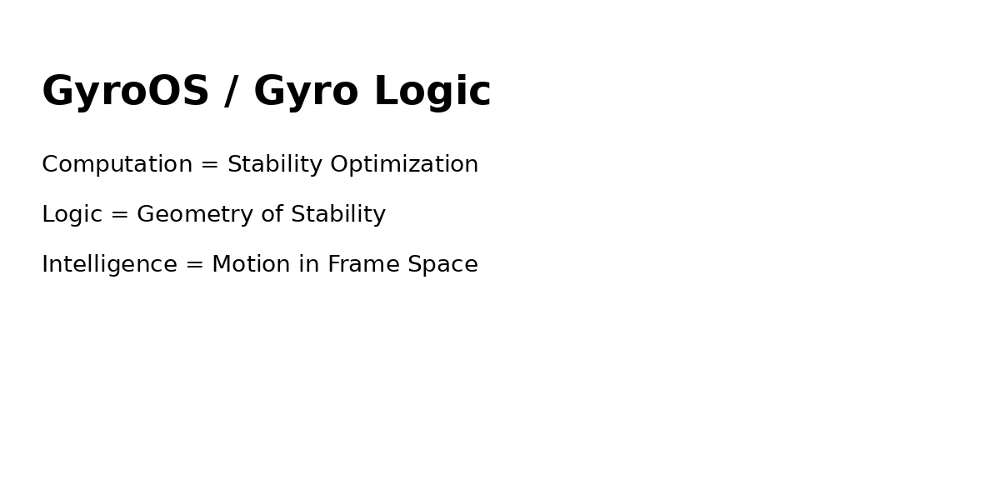

> Computation is not a function.  
> It is a trajectory shaped by competing frames.

---

## 🎥 What is Gyro Logic?

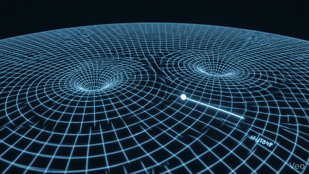

---

## ⚡ Why this is different

### Traditional Computing
Input → Function → Output

### Gyro Computing
State → Dynamics → Attractor

---

### Traditional AI
- Single model
- Fixed interpretation
- Static inference

### Gyro Logic
- Multiple competing frames
- Dynamic interpretation
- Trajectory-based inference

---

## 🧠 Core Idea

Meaning   = stabilized behavior  
Truth     = stability-weighted projection  
Inference = trajectory toward attractor  
Conflict  = interference between frames  

---

## 🔥 Core Equations

dB/dt = ∇_B L(B,F)  
dF/dt = ∇_F L(B,F) - λ∇_F Ξ  

---

## 📐 Research Figures

### Figure 1 — Unified Architecture

### Figure 2 — Mathematical Structure
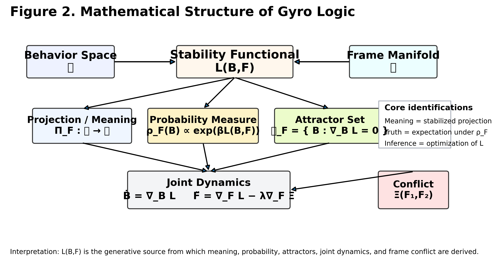

### Figure 3 — Inference Dynamics
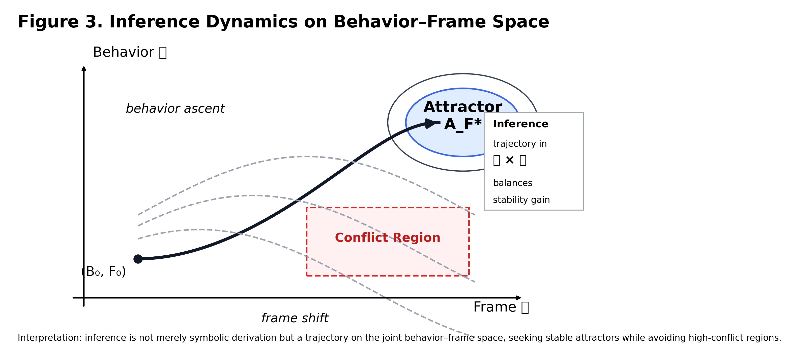

### Figure 4 — Conflict Geometry
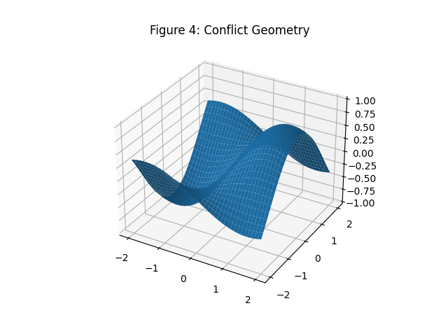

> Conflict is not an error.  
> It is curvature in frame space.

---

## 🕳 Hole / Void (Key Concept)

A "hole" is not an object.

It is a region that cannot be occupied under stability dynamics.

### Definition

- **Hole**: bounded region of zero stability enclosed by stable regions  
- **Void**: globally unreachable region across all frames  

### Interpretation

- Objects = stable regions  
- Holes = locally forbidden regions  
- Void = globally forbidden regions  

### Figure 5 — Hole Structure in Stability Space
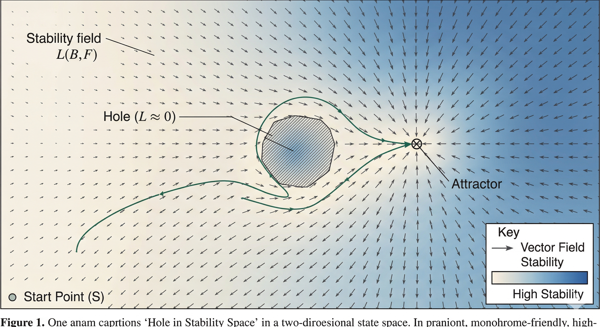

### Dynamic Effect

Holes are not static.

They:

- bend trajectories  
- constrain inference  
- emerge through conflict  
- disappear under local decomposition  

---

## 🔄 Phase Transition (Hole Formation)

Holes are not predefined structures.

They **emerge dynamically** through topological changes in the stability landscape.

### Figure 6 — Hole Formation (Mathematical)
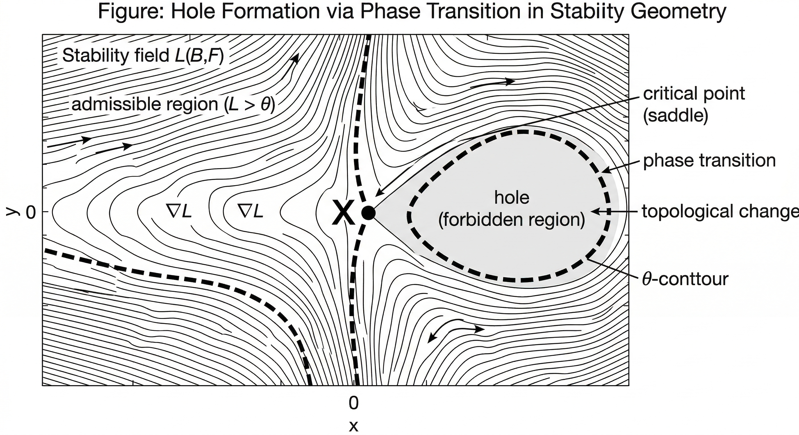

- Saddle critical point: ∇L = 0  
- det(Hessian) < 0  
- Topology changes at threshold L = θ  

---

### Figure 6b — Phase Transition (Before / After)
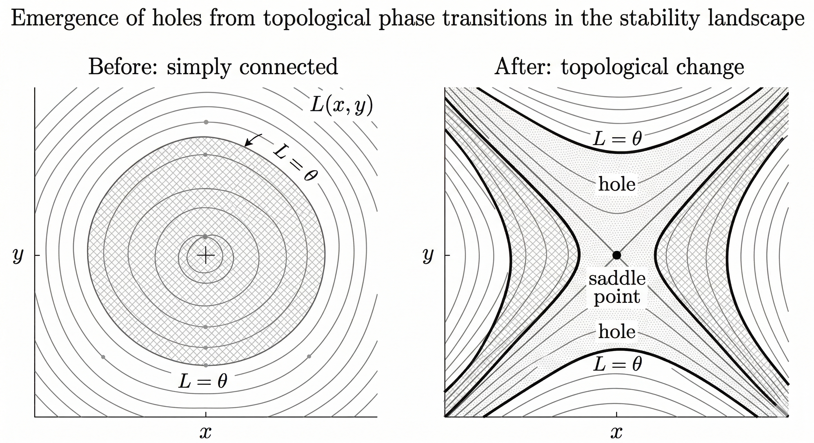

- Before: simply connected region  
- After: hole emerges  
- Betti number changes (β₁: 0 → 1)

---

## 🔬 Conflict Visualization

### Inference Trajectory (Trajectory Shaped by Constraints)
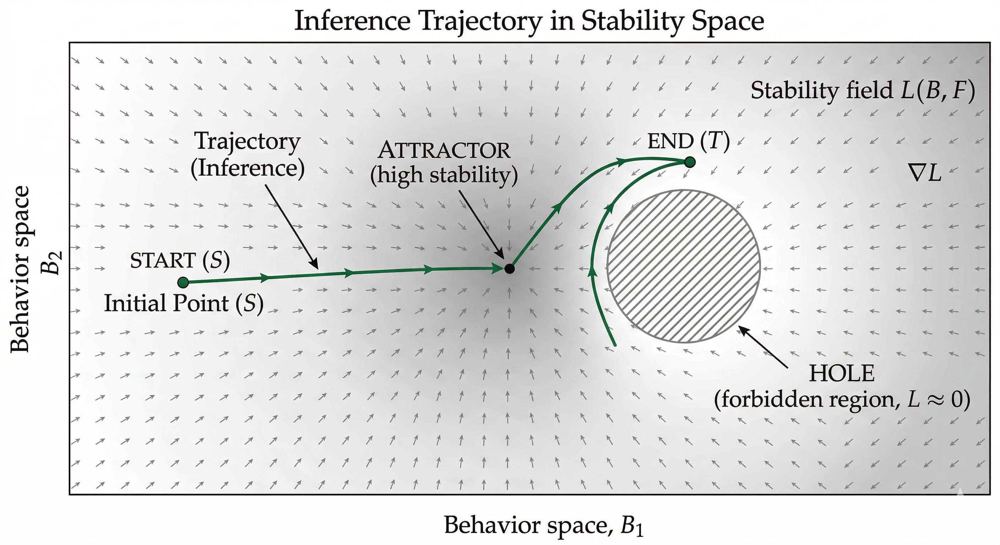

> Inference is shaped not only by attractors, but by forbidden regions.

---

### Stability Evolution (Competing Frames)
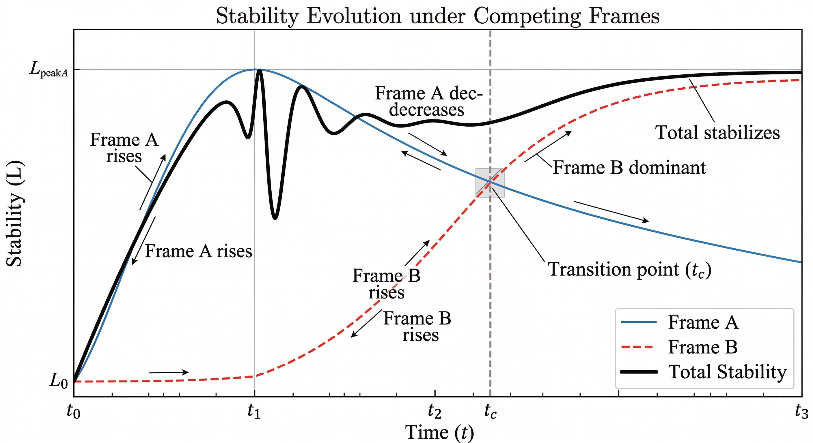

> Stability emerges through competition and transition between frames.

---

### Conflict Dynamics (Driver of Structural Change)
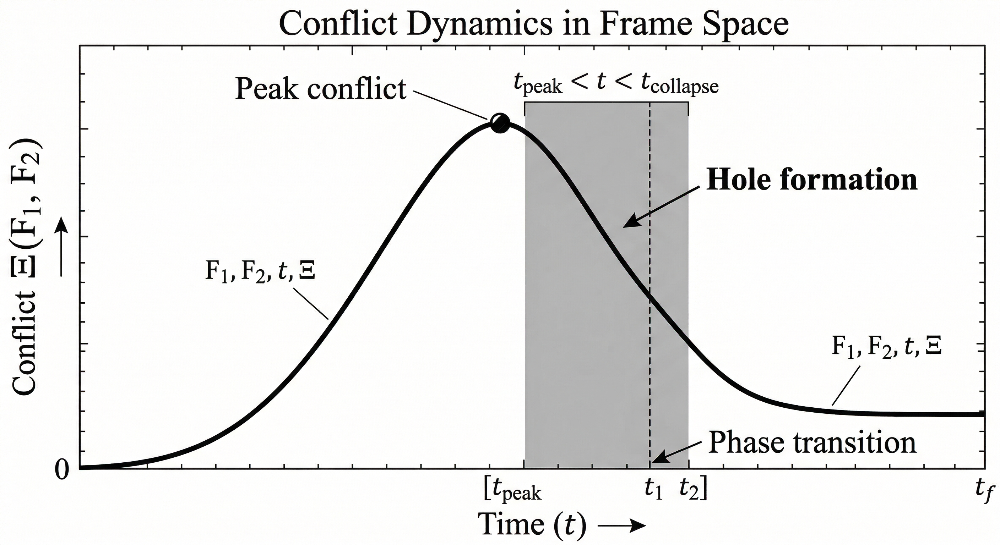

> Conflict is not noise.  
> It generates new structure (holes) in the stability landscape.
---

## ⚙️ Demos

### ▶ Basic Demo
python gyro_demo_v2.py

### ▶ Conflict Demo (Key)
python gyro_conflict_demo.py

---

## 🧩 System Mapping

| Concept | Role |
|--------|------|
| Behavior | State |
| Frame | Perspective / Scheduler |
| Stability | Objective / Fitness |
| Conflict | Interference |
| Inference | Optimization trajectory |

---

## 🌌 Concept

Traditional reasoning:
fixed model → fixed answer  

Gyro reasoning:
multiple frames → conflict → stabilization  

---

## 🚨 Key Insight

Inference ≠ computation step  
Inference = trajectory in (Behavior × Frame) space  

---

## 📌 Current Status

- [x] Formal Theory
- [x] Research Figures
- [x] Dynamic Demo
- [x] Conflict Demo
- [x] Visualization
- [ ] Multi-agent system
- [ ] GyroOS kernel
- [ ] arXiv paper

---

## 🔭 Vision

GyroOS is:

→ A Meaning-Centric Operating System  
→ A Multi-Dimensional Logic Engine  
→ A New Computational Paradigm  

---

## 🧨 Core Claim

Computation = Stability Optimization  
Logic = Geometry of Stability  
Intelligence = Motion in Frame Space  

---

## 🚧 Roadmap

Phase 1 (Now): Theory / Visualization / Demo  
Phase 2: Multi-frame systems  
Phase 3: GyroOS kernel  
Phase 4: New computing paradigm  

---

## 🔁 Spin-off Projects

GyroLogic is not just a theoretical framework.  
It is designed to generate real-world applications across multiple domains.

### 🔐 GyroAuth  
Spatio-temporal multi-dimensional authentication

👉 https://github.com/gitGyro-Dev/gyroauth  

GyroAuth applies GyroLogic to authentication, redefining identity verification as:

**multi-dimensional state convergence across space, time, and motion**

---

More spin-off applications will be added.

## 📄 Citation

DOI: https://doi.org/10.5281/zenodo.19428071

---

## 👤 Author

kawakami