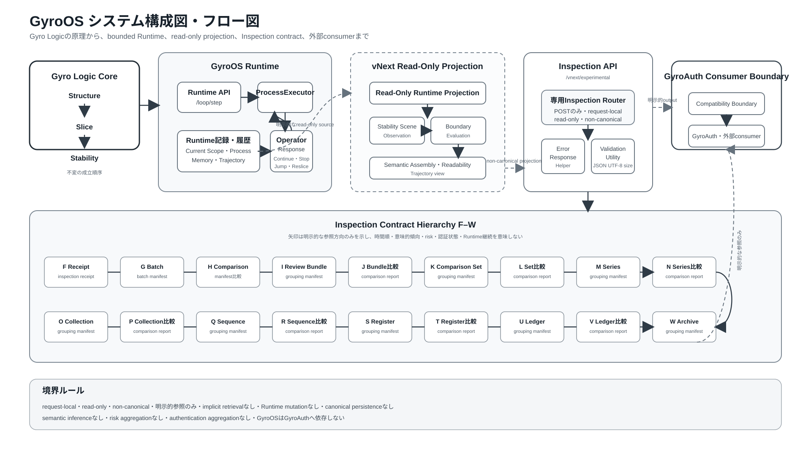

# GyroOS

**Gyro Process、Operator Response、Context-aware Runtime、Dynamic Equivalence のための実行アーキテクチャ**

---

## 🧭 GyroOSとは何か

GyroOS は **Gyro Logic** の実装層である。

GyroOS は Gyro Logic を再定義しない。  
Gyro Logic を実行可能なランタイムシステムとして実装する。

不変の理論コアは次である。

```text
Structure → Slice → Stability
```

GyroOS は、このコアを Runtime Continuity へ写像する。Slice の内部的なRuntime読解は次である。

```text
Structure
→ Slice {
    Operator Orientation
    → slice-ing
    → slice-done
  }
→ Stability
→ Operator Response
→ Next Process
```

Operator Orientation、slice-ing、slice-done は Slice 内部の区別であり、追加のCore Stageではない。

GyroOS は応用層ではない。  
GyroAuth は GyroOS の上に構築される応用層である。

---

## 🧩 スタック上の位置づけ

```text
Gyro Logic   = 理論層
GyroOS       = 実装層
GyroAuth     = 応用層
```

原則：

```text
Gyro Logic は GyroOS に依存しない。
GyroOS は Gyro Logic を実装する。
GyroAuth は GyroOS を応用する。
```

GyroOS は、実装都合によって Gyro Logic の定義を変更してはならない。

### システム構成とフロー



この図は、Gyro Logicの不変CoreからGyroOS Runtime、vNext read-only projection、POSTのみのInspection API、明示的参照によるF〜W hierarchy、外部のGyroAuth consumer boundaryまでを一枚で示す。

公開用マスター図版：

- 日本語SVG：`figures/gyroos_system_architecture_flow_jp.svg`
- 英語SVG：`figures/gyroos_system_architecture_flow_en.svg`
- 構成図の説明・キャプション案：`docs/292_gyroos_system_architecture_flow_overview.md`

---

## 🔁 コア原則

コア原則は常に次である。

```text
Structure → Slice → Stability
```

これは時間なしの Gyro Unit である。

GyroOS は、この構造を Gyro Process としてRuntime上で読む。

```text
Structure
→ Slice {
    Operator Orientation
    → slice-ing
    → slice-done
  }
→ Stability
→ Operator Response
```

Gyro Loop は Structure → Slice → Stability を置き換えるものではない。

Gyro Loop は、Operator Response によって Gyro Process が反復される構造である。

---

## 🧠 Gyro Unit / Process / Loop

### Gyro Unit

```text
Gyro Unit = Structure → Slice → Stability
```

Gyro Unit は時間なしの理論構造である。

Operator Orientation、slice-ing、slice-done は Slice 内部の区別として読める。Operator Response、Context Loop、Dynamic Equivalence は不変のCore Sequenceには含まれない。

---

### Gyro Process

```text
Gyro Process
= Structure
→ Slice {
    Operator Orientation
    → slice-ing
    → slice-done
  }
→ Stability
→ Operator Response
```

Gyro Process は、継続するTrajectory内に現れる時間ありの一つのRuntime断面である。

時間は主に次に現れる。

```text
slice-ing
Operator Response
```

---

### Gyro Loop

```text
Gyro Loop = Gyro Process の反復構造
```

より正確には：

```text
Gyro Processₙ
→ Operator Responseₙ
→ Gyro Processₙ₊₁
```

Loop は Stability が直接制御するのではなく、Operator Response によって制御される。

---

## 🧠 主要概念

### Structure

Structure は、何かが成立し得るRuntime上の様式である。

状態・関係・場・処理条件・Runtime Configurationとして現れうるが、単なる入力値や固定Containerには限定されない。

現在のRuntime Structureは、過去の変化を保持しながら、次のSliceへ開かれている。

---

### Operator Orientation

Operator Orientation は、Slice の入口および内部にある方向条件である。

何を求めるか、どのDifferenceを重視するか、どの方向を開くか、どの粒度やContextを関連づけるかを表現しうる。

独立したCore Stageではなく、Sliceそのものでもない。

```text
Slice {
  Operator Orientation
  → slice-ing
  → slice-done
}
```

---

### Slice

Slice は、Structure の中に一つの成立へ向かうRuntime Pathが開かれる過程である。

計算・変換・観測・探索・選択・解釈などによって実装されうるが、そのいずれか一つに還元されない。

GyroOS におけるSlice内部のRuntime読解は次である。

```text
Operator Orientation
→ slice-ing
→ slice-done
```

---

### slice-ing

slice-ing は、道筋が開かれている時間を含むRuntime過程である。

```text
slice-ing = Slice in progress
```

計算・変換・観測・探索・認識などはこの過程で行われうる。

---

### slice-done

slice-done は、Slice が一つの成立した結果として読める状態である。

GyroOS は、この成立したSlice Resultを次のように表現できる。

```text
slice-done = X + Δ
```

ここで：

```text
X = Slice によって得られた Representation
Δ = Structure と Representation のズレ
```

GyroOS では、slice-done の周辺に追加のランタイム情報を保持できる。

```text
Boundary
Boundary State
Context
Void
Metadata
```

これらはSlice Resultから読まれる、または派生する関係であり、不変コアを変更しない。

---

### Δ / Deviation

Deviation は、消すべきエラーではない。

```text
Δ = Structure と Representation のズレ
```

GyroOS は Δ を保持し、評価対象として扱う。

---

### Context

Context は、Slice によって明示的に表現されなかったが、Operator によって推定可能な周辺 Structure である。

```text
Context = inferred surrounding structure
```

Context は次の性質を持つ。

```text
operator-relative
slice-dependent
provisional
inferred
```

Context は Representation ではない。  
Context は Void でもない。

---

### Re-Slice

Re-Slice は、既存のランタイム結果、特に Context に対して行われる二次的な Slice である。

```text
Re-Slice = Slice over Context or prior SliceDone
```

重要：

```text
Re-Slice は Operator Response によって選択される。
Stability が Re-Slice を直接開始するわけではない。
```

---

### Stability

Stability は、Slice によって開かれた道筋が、継続可能な一つの成立として読める状態である。

制御者、Success Flag、終了状態、Stop条件ではない。

```text
Stability = opened path の continuing established state
```

Stability は観測・測定・保存され、Operator Response に渡される。

---

### Operator Response

Operator Response は、Stability 後に Operator が行う反応である。

GyroOS v4.0以降では、主に Loop Controller によって実装される。

Operator Response は次を決定しうる。

```text
Continue
Adjust
Stop
Re-Slice Context
Defer Void
Jump
Void handling
```

---

### Void

Void は、現在の Slice では接続・推定・評価できない領域または状態である。

Void は自分で作用しない。

Operator Response が Void への対応を決める。

---

### Jump

Jump は、Orientation、Slice、Structure mapping の非連続的な再構成である。

Jump は Operator Response によって選択される。

---

### Dynamic Equivalence

Dynamic Equivalence は、Trajectory に基づく等価性である。

2つの状態は、静的には異なっていても、Stability を保持する Trajectory によって接続されるなら、動的に等価でありうる。

```text
A ≠ B
but
A ≈_T B
```

Dynamic Equivalence は単なる類似度ではない。

必要条件：

```text
Trajectory
Stability preservation
allowed Δ
Context consistency
```

---

## 🏗️ アーキテクチャ

Repository全体の構成は、上記の公開用図版および`docs/292_gyroos_system_architecture_flow_overview.md`を参照する。

```text
Runtime Structure
   ↓
Slice Engine {
   Operator Orientation / Slice Policy
      ↓
   slice-ing
      ↓
   SliceDone {
     representation: X,
     deviation: Δ,
     boundary: B,
     boundary_state: BS,
     context: C,
     void: V,
     metadata: M
   }
}
   ↓
Deviation Engine
   ↓
Stability Engine
   ↓
StabilityResult
   ↓
Loop Controller
   ↓
Operator Response
   ├─ Continue
   ├─ Adjust → Update Engine
   ├─ Re-Slice Context → Re-Slice Engine
   ├─ Defer Void
   ├─ Jump → Update Engine
   └─ Stop
   ↓
Next Orientation / Next Process
```

---

## 🔧 コアランタイムコンポーネント

### Slice Engine

Operator Orientation のRuntime表現を適用し、slice-ing を実行し、読めるslice-done Resultを生成する。

---

### Context Runtime

SliceDone の周辺情報として、推定された周辺 Structure を保持する。

Context は将来的な Re-Slice 対象になりうる。

---

### Re-Slice Engine

Operator Response によって要求された場合に、Context または既存の SliceDone に対して二次的 Slice を実行する。

---

### Deviation Engine

Δ を抽出し、保持する。

---

### Stability Engine

slice-done に成立した道筋が、一つの成立として継続可能かを読む。

Loop を制御しない。

---

### Loop Controller

Operator Response を実装する。

Stability が得られた後のResponse判断を所有する。

正しい関係：

```text
Stability
→ Loop Controller / Operator Response
→ Next Process
```

---

### Update Engine

Operator Responseによって要求された場合にのみ更新を適用する。

GyroOS の中心ではない。

正しい関係：

```text
Loop Controller / Operator Response
→ 必要に応じて Update Engine
→ Next Orientation
```

---

### Dynamic Equivalence Runtime

2つの状態を静的等価へ還元せず、Trajectory上での等価性を評価する。

出力：

```text
equivalent | not_equivalent | undecidable
```

---

## 🔁 GyroOS Runtime Flow

各Process Cycleでは次を行う。

```text
1. 現在の Runtime Structure を読む
2. Operator Orientation / Slice Policy のもとで Slice に入る
3. slice-ing を実行する
4. SliceDone = X + Δ と Boundary / Boundary State / Context / Void を生成する
5. Stability を継続可能な成立として読む
6. Loop Controllerを通じてOperator Responseを実行する
7. 選択に応じてRe-Slice Context、Defer Void、Jump、Stop、Continueを行う
8. Next Orientation または Next Process を準備する
```

---

## 🌐 Priority G Bounded Runtime API

Priority Gは、不変Coreを変更せず、boundedかつpersistentなRuntime APIを追加する。

```text
POST /loop/step
GET  /loop/state/{loop_id}
GET  /loop/history/{loop_id}
GET  /trajectory/{trajectory_ref}
GET  /process/{process_id}
GET  /memory/record/{record_id}
```

Runtime persistenceは、atomicなSQLite-backed repository boundaryとして実装される。

```text
complete Process result group
→ atomic publication
→ current-scope pointer update
→ immutable Process and Trajectory history
→ restart後のtyped canonical reconstruction
```

Query surfaceは、新しいProcessを実行せず、Operator Responseを選択せず、hidden latest stateを推定せず、repository absenceをVOID、DEFER、STOP、Stability resultへ変換しない。

詳細contractは`docs/66_*`から`docs/75_*`に記録されている。

---

## 🛡️ Priority H Production Hardening

Priority Hは、canonicalなGyro Process semanticsを変更せずにPriority G Runtime boundaryを強化する。

実装済みcontrol：

```text
development / test / production settings profile
production configuration fail-fast
Runtime endpointへのBearer authentication
request-body、rate、concurrent-request limit
SQLite WALとbounded lock waiting
retryable repository-busy classification
JSON structured loggingとX-Request-ID correlation
database schema compatibility validation
検証済みSQLite backup and restore
production token quality check
security response header
bounded concurrent / sustained load test
```

現在のcandidateは、single-host、SQLite-backed、単一Bearer token構成のbounded Runtimeである。

Public production exposureには、TLS、network policy、secret injection、backup storage、logging destination、capacity、rollback、operator ownershipのdeployment declarationが必要である。

詳細contractは`docs/76_*`から`docs/85_*`に記録されている。

---

## 🧪 vNext Experimental Projection and Inspection

`/vnext/experimental`は、read-only、request-local、non-canonicalなprojectionおよびInspection contractを提供する。

Inspection contract familyは、F ReceiptからW Comparison Archiveまでを明示的参照のみで接続する。Runtime stateを変更せず、canonical persistenceを作らず、semantic trend、risk、authentication decisionを生成しない。

主要な参照先：

- Inspection documentation index：`docs/283_vnext_inspection_documentation_index.md`
- Consolidation completion：`docs/291_vnext_inspection_consolidation_implementation_completion_review.md`
- システム構成図：`figures/gyroos_system_architecture_flow_jp.svg`

---

## 📄 リリース・投稿用図版

このシステム構成SVGを、次期GyroOS Release Candidate、GitHub Release Notes、README、将来のjxiv投稿における主要overview figureとして使用する。

SVGをマスターとし、PDFまたはPNGは投稿先・公開先が要求する場合のみ派生させる。

- 日本語マスター：`figures/gyroos_system_architecture_flow_jp.svg`
- 英語マスター：`figures/gyroos_system_architecture_flow_en.svg`
- 図版利用ノート：`docs/292_gyroos_system_architecture_flow_overview.md`
