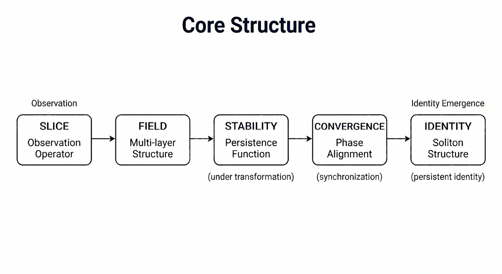
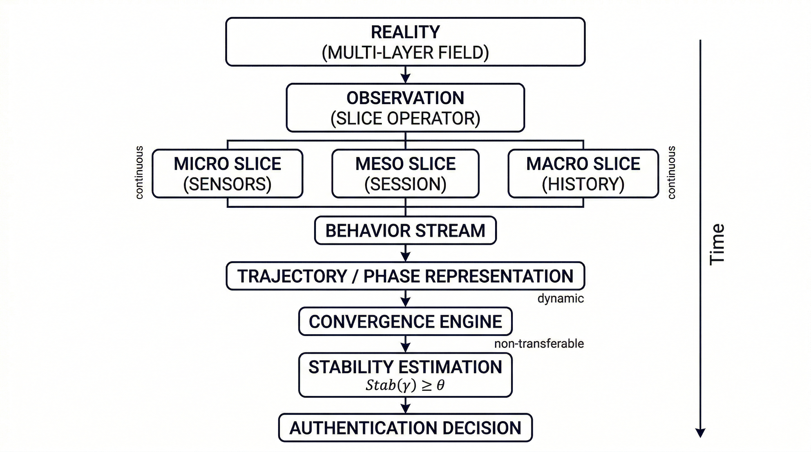

# Gyro Logic: Stability-Based Framework for Meaning, Identity, and Authentication  
ジャイロロジック：意味・同一性・認証のための安定性ベース理論

---

## Abstract / 要旨

### Abstract (English)

Gyro Logic is a theoretical framework that redefines meaning, inference, and identity through the concept of stability and dynamic behavior.

Reality is observed through slicing operations that generate structured multi-layer fields. Stability is defined as persistence under transformation and forms the basis for meaning, truth, and inference. Convergence is defined as phase synchronization rather than strict equality, and identity is modeled as a soliton-like structure that persists under disturbance.

This paper presents the minimal core structure of Gyro Logic:

Slice → Field → Stability → Convergence → Identity

We further present GyroAuth, an authentication framework derived from Gyro Logic, where identity verification is defined as convergence of multi-dimensional states across time, space, device, and motion.

---

### 要旨（日本語）

本稿では、意味・推論・同一性を「安定性（Stability）」と動的振る舞いに基づいて再定義する理論的枠組み Gyro Logic を提示する。

現実は直接扱うことができず、観測操作（Slice）を通じて多層構造を持つ場（Field）として構成される。安定性は変換に対する持続性として定義され、意味・真理・推論の基盤となる。収束は同一性ではなく位相同期として再定義され、同一性は外乱下でも構造を保つソリトン的構造として理解される。

さらに応用例として GyroAuth を提示し、認証を静的な照合ではなく、多次元状態の収束として再定義する。

---

## 1. Introduction

Traditional computational and logical frameworks often treat computation as static mappings from input to output. However, real-world reasoning, identity, and authentication involve dynamic processes shaped by multiple perspectives and temporal evolution.

This paper proposes Gyro Logic, a framework that places stability at the center of meaning, inference, and identity.

---

## 2. Background

Traditional computation follows a pipeline:

Input → Function → Output

Such static mappings struggle to model dynamic reasoning and multi-frame interpretation. Gyro Logic instead treats inference as a trajectory shaped by stability.

---

## 3. Core Concepts of Gyro Logic

### 3.1 Observation and Slice

Reality is not directly accessible.  
It is observed through slicing operations.

- Snapshot  
- Time series  
- Distribution  
- Trajectory  

Slice is an operator, not the reality itself.

---

### 3.2 Field Structure

Slices generate structured multi-layer fields consisting of:

- Spatial layers  
- Temporal layers  
- Distribution layers  

The field is the substrate on which stability is evaluated.

---

### 3.3 Stability

Stability measures persistence under transformation.

- Meaning emerges from stability  
- Truth is a stable projection  
- Robustness defines significance  

---

## 4. Stability and Convergence

### 4.1 Stability as a Function

The dynamics of behavior and frame are defined as:

$$
\frac{dB}{dt} = \nabla_B L(B, F)
$$

$$
\frac{dF}{dt} = \nabla_F L(B, F) - \lambda \nabla_F \Xi
$$

Here,

- $B$ denotes behavior.
- $F$ denotes frame.
- $L(B, F)$ is a stability-driven objective function.
- $\Xi$ represents frame interference or conflict.
- $\lambda$ is a weighting coefficient.

These dynamics describe how behavior and frames co-evolve within a stability landscape.

4.2 Convergence as Phase Synchronization

Convergence is not equality.

It is alignment in phase space.

Figure 1: Convergence as phase synchronization. States align in phase rather than becoming identical.

5. Identity as Soliton

Identity is defined as a persistent dynamic structure.

A soliton-like structure preserves its form under disturbance.

Figure 2: Identity as soliton. Structure persists through disturbance.

6. Core Structure of Gyro Logic

The minimal core structure:

Slice → Field → Stability → Convergence → Identity

Figure 3: Core structural flow of Gyro Logic.

## 7. Application: GyroAuth

### 7.1 Motivation

Traditional authentication relies on static identifiers.
GyroAuth redefines authentication as state convergence.

7.2 GyroAuth Model

Authentication is achieved through convergence across:

Time
Space
Device
Motion

Identity emerges dynamically.

8. Future Work
Adaptive stability
Operator algebra
Topological structures (Hole / Void)
GyroOS integration
9. Conclusion

Gyro Logic provides a unified framework for meaning, inference, and identity through stability. It bridges theoretical foundations and practical applications such as authentication.

Keywords

Stability, Phase Synchronization, Soliton, Identity, Dynamic Systems, Authentication