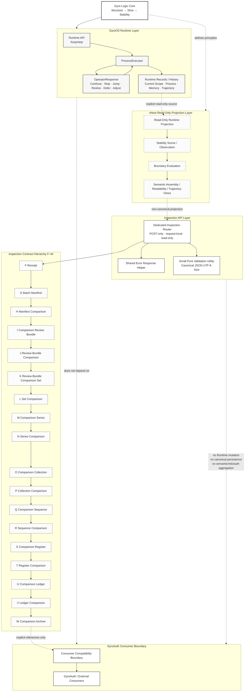

# GyroOS System Architecture and Flow



## Reading the Diagram

- `Gyro Logic Core` defines the invariant order `Structure → Slice → Stability`.
- `GyroOS Runtime` executes bounded processes and owns Runtime state, history, and persistence boundaries.
- `vNext Read-Only Projection` observes Runtime outputs without changing Runtime state.
- `Inspection API` exposes request-local, POST-only inspection contracts.
- Gates `F–W` form an explicit-reference hierarchy. The arrows do not imply chronology, semantic trend, risk, authentication state, or Runtime continuation.
- `GyroAuth` and other consumers remain outside GyroOS. They consume explicit outputs through the consumer compatibility boundary.

## Boundary Rules

```text
request-local
read-only
non-canonical
explicit references only
no implicit retrieval
no Runtime mutation
no canonical persistence
no semantic inference
no risk aggregation
no authentication aggregation
```
