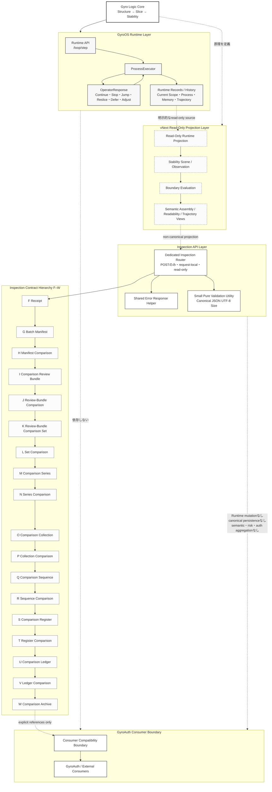

# GyroOS システム構成図・フロー図



## 図の読み方

- `Gyro Logic Core`は、不変順序である`Structure → Slice → Stability`を定義します。
- `GyroOS Runtime`は、bounded processを実行し、Runtime state、history、persistence boundaryを所有します。
- `vNext Read-Only Projection`は、Runtime stateを変更せずにRuntime outputを観測します。
- `Inspection API`は、request-localかつPOSTのみのinspection contractを公開します。
- Gate `F–W`は、明示的参照による階層です。矢印は、時間順、意味的傾向、risk、authentication state、Runtime continuationを意味しません。
- `GyroAuth`および外部consumerはGyroOSの外側にあり、consumer compatibility boundaryを通して明示的outputを利用します。

## 境界ルール

```text
request-local
read-only
non-canonical
explicit references only
no implicit retrieval
no Runtime mutation
no canonical persistence
no semantic inference
no risk aggregation
no authentication aggregation
```
