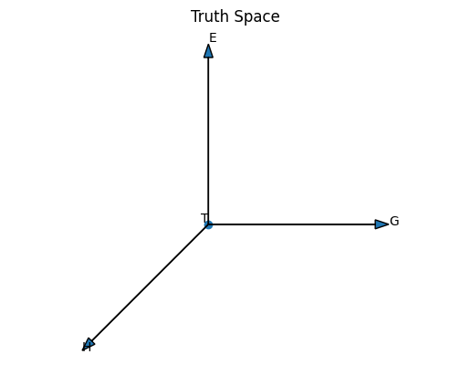
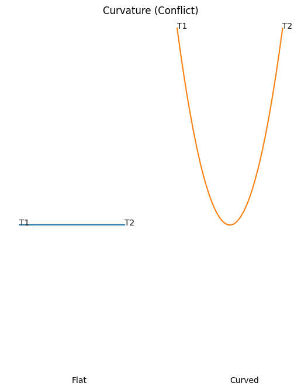
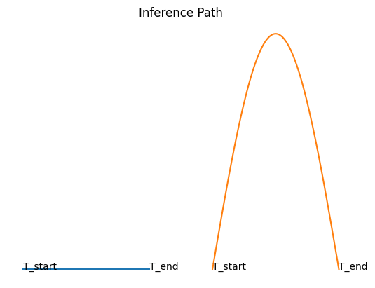

# GyroOS / Gyro Logic

**A New Paradigm of Observer-Dependent Logic**

---

## 🧭 Overview

Gyro Logic is a novel logical framework in which:

* Truth is **not absolute**
* Truth is **observer-dependent**
* Truth evolves with **time, goals, expectations, and history**

[
T = \mathrm{Eval}(\mathrm{Slice}(W, O, Q), G, E, H)
]

---

## 🧠 3-Layer Architecture

This project is structured into three conceptual layers:

---

### ① Formal Layer（概要）

📄 [Formal PDF](./docs/GyroLogic_Formal_v1.pdf)

* Truth = point in manifold
* Transform = re-evaluation
* Conflict = curvature
* Inference = geodesic

---

### ② Intuition Layer（直感）

📄 [Intuition PDF](./docs/GyroLogic_Intuition_v1.pdf)

* Truth changes with perspective
* Conflict is not an error
* Understanding is path-dependent

---

### ③ Mathematical Layer（数理）

📄 [Mathematical PDF](./docs/GyroLogic_Mathematical_v1.pdf)

* Fiber bundle structure
* Connection ∇
* Curvature R
* Gyro Algebra

---

## 🌌 Geometry of Gyro Logic

### Truth Space



### Curvature (Conflict)



### Inference Path



---

## 🧩 System Mapping

| Concept   | Geometry   | Computation   |
| --------- | ---------- | ------------- |
| Truth     | Point      | State         |
| Conflict  | Curvature  | Inconsistency |
| Inference | Geodesic   | Reasoning     |
| Transform | Connection | Re-evaluation |

---

## 🌐 Core Insight

> Truth is not a value —
> **it is a position in a curved space**

---

## 🚀 Why This Matters

* AI reasoning beyond static logic
* Multi-agent systems with conflicting truths
* Human-like interpretation systems
* A new OS paradigm (GyroOS)

---

## 🔬 Roadmap

* [ ] Gyro Algebra refinement
* [ ] GyroOS Kernel implementation
* [ ] GyroVM architecture
* [ ] arXiv publication

---

## 📁 Project Structure

```
gyroos/
├── docs/
│   ├── gyro_logic/
│   │   ├── GyroLogic_Formal_v1.pdf
│   │   ├── GyroLogic_Intuition_v1.pdf
│   │   ├── GyroLogic_Mathematical_v1.pdf
│   ├── gyroos_truth_space.png
│   ├── gyroos_curvature.png
│   ├── gyroos_inference.png
```

---

## 🧪 Status

This project is currently in:

**→ Theoretical Formalization Phase**

---

## ✨ Author Vision

Gyro Logic aims to redefine logic itself:

* From static → dynamic
* From absolute → relative
* From boolean → geometric

---

## 📌 Next Step

> Geometry → Algebra → Computation → OS

---
