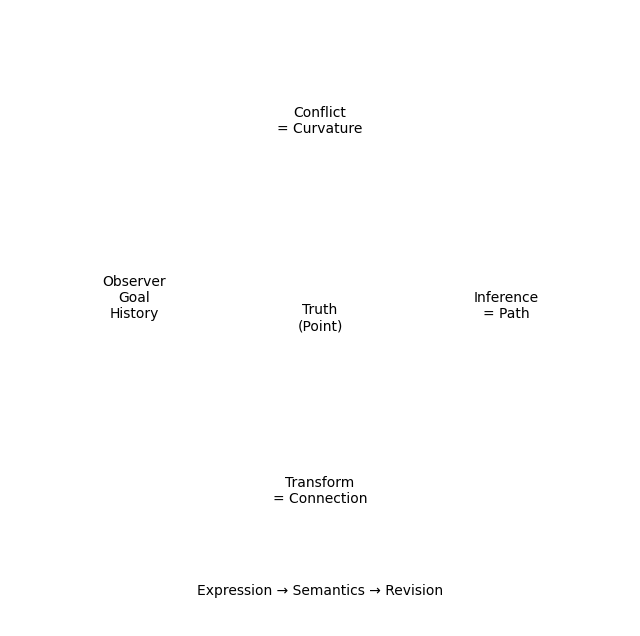

# Gyro Logic

**A Geometric, Observer-Dependent, and Self-Evolving Logical Framework**

---



---

## 🧭 Overview

Gyro Logic is a novel logical framework where:

* Truth is not a fixed value
* Truth is observer-dependent
* Truth evolves with context and history

[
T = \mathrm{Eval}(\mathrm{Slice}(W, O, Q), G, E, H)
]

---

## 🌌 Core Idea

> **Truth is not a value — it is a position in a geometric space**

* Truth = point in manifold
* Conflict = curvature
* Inference = geodesic
* Logic = dynamic evolution

---

## 🧠 Key Components

### 1. Truth Space

[
T \in \mathcal{M}
]

* Metric structure
* Observer-dependent evaluation

---

### 2. Conflict as Curvature

[
\mathrm{Conflict}(T_1,T_2) \propto |R|
]

* Non-commutativity induces curvature
* Conflict is structural, not error

---

### 3. Inference as Geometry

[
\gamma^* = \arg\min \int (|\dot{\gamma}|^2 + \lambda |R|)
]

* Reasoning = path optimization
* Geodesic = valid inference

---

### 4. Invariant Structure

[
I(T) = I(\mathcal{G}(T))
]

* Meaning-preserving transformations
* Structural consistency

---

### 5. Self-Evolving Logic

[
\mathcal{R} : (\mathfrak{E}, \Sigma) \rightarrow (\mathfrak{E}', \Sigma')
]

* Logic evolves
* Semantics are versioned

---

## 🧩 Architecture

### Expression → Semantics → Revision

* Expression: multi-dimensional representation
* Semantics: structured meaning
* Revision: dynamic update

---

## 🧪 Documents

### 📄 Short Paper

* [Gyro Logic Short Paper](./docs/gyro_logic/GyroLogic_ShortPaper_v1.pdf)

### 📘 Full Paper (arXiv draft)

* [Gyro Logic v6](./docs/gyro_logic/GyroLogic_arxiv_v6.tex)

---

## 🧠 DeepMind-Oriented Deck

* [Pitch Deck (DeepMind version)](./docs/gyro_logic/GyroLogic_DeepMind_Pitch_v2.pptx)

---

## 🎯 Why This Matters

Gyro Logic provides:

* A unified framework for context-dependent reasoning
* A bridge between logic, geometry, and computation
* A potential foundation for next-generation AI systems

---

## 🚀 Vision

### Toward GyroOS

* Logic-native operating system
* Context-aware computation
* Semantic state management

---

## 🔬 Research Position

This work connects to:

* Non-monotonic logic
* Modal and contextual logic
* Differential geometry
* Category theory

---

## 🤝 Collaboration

We are interested in:

* Research collaboration
* Theoretical exploration
* AI reasoning systems

---

## 📌 Status

**Research Prototype — Open for Collaboration**

---

## 📁 Repository Structure

```
gyroos/
├── docs/
│   ├── gyro_logic/
│   │   ├── GyroLogic_arxiv_v6.tex
│   │   ├── GyroLogic_ShortPaper_v1.pdf
│   │   ├── GyroLogic_DeepMind_Pitch_v2.pptx
│   ├── gyroos_master_diagram.png
│   ├── gyroos_theoretical_diagram.png
```

---

## ⚠️ Note

This is an early-stage theoretical framework.
The formalization and implementation are ongoing.

---

## ✨ Final Statement

> Logic is not static — it is a dynamic geometric process.
