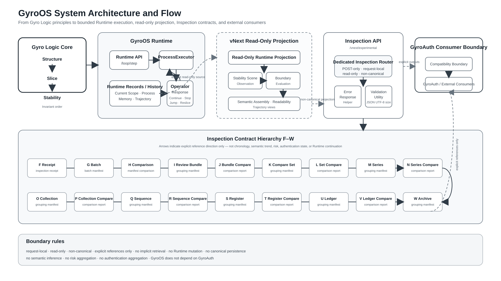

# GyroOS: A Bounded Runtime Architecture for Structure-Slice-Stability, Read-Only Projection, and Explicit Inspection Contracts

**Shuntaro Kawakami**  
Independent Researcher  
ORCID: 0009-0004-0091-1303  
Corresponding author: dev.jxiv@gyro-wedge.com

## Abstract

Gyro Logic defines an invariant establishment order as `Structure -> Slice -> Stability`. Implementing this order on finite computational resources raises a practical architecture problem: Runtime continuity must be represented without collapsing an evolving Trajectory into one current state, rewriting canonical history, or allowing downstream interpretation to mutate the Runtime that produced the observed result. This paper presents GyroOS v4.0.0 as a bounded Runtime architecture that separates five responsibilities: bounded execution, canonical Runtime ownership, read-only projection, non-canonical Inspection, and external consumer interpretation. One bounded request executes one bounded Gyro Process through `/loop/step`; canonical Process, Trajectory, current-scope, and Memory records remain owned by the Runtime; vNext projections observe explicitly supplied Runtime outputs without changing Runtime state; POST-only Inspection contracts F-W build request-local artifacts through explicit references; and GyroAuth remains outside the GyroOS implementation boundary as a consumer. The implementation is single-host and SQLite-backed, and the vNext Inspection contracts remain experimental. The contribution is not a complete mathematical formalization of Gyro Logic, but a Gyro-specific implementation discipline that preserves the invariant Core by separating execution, persistence, projection, inspection, and consumption.

**Keywords:** Gyro Logic; GyroOS; bounded runtime; Structure-Slice-Stability; trajectory continuity; read-only projection; inspection contracts; runtime architecture

## 1. Introduction

Gyro Logic is a theoretical framework whose invariant Core is:

```text
Structure -> Slice -> Stability
```

GyroOS is the execution layer that implements this Core as a Runtime system. The implementation problem is not merely to calculate a result. A finite computer must decide what is executed within one request, what is retained after execution, what counts as canonical Runtime history, which derived views are read-only, and where external interpretation begins.

A conventional implementation can easily collapse these concerns. A current state may be treated as if it were the whole Trajectory. A derived projection may be written back into canonical history. An inspection output may acquire semantic, risk, or authentication meaning that was not produced by the Runtime. Such coupling changes the meaning of the theoretical Core through implementation convenience.

GyroOS v4.0.0 addresses this problem by introducing explicit architectural boundaries. Bounded execution is separated from persistence. Canonical Runtime records are separated from derived views. Read-only projection is separated from Inspection. Inspection artifacts are separated from external consumer decisions. The architecture therefore preserves the direction:

```text
Gyro Logic
-> GyroOS
-> GyroAuth / external consumers
```

without making GyroOS depend on GyroAuth.

The implementation snapshot described in this paper is fixed by GitHub Release `v4.0.0` and archived on Zenodo as record `21641158` [1].

## 2. Related Work and Positioning

GyroOS is adjacent to, but not identical with, several established architecture patterns.

Event Sourcing retains changes as an event sequence rather than storing only a current state [2]. GyroOS similarly avoids reducing Runtime continuity to one mutable latest state, but it does not claim that all Runtime behavior is reconstructed through complete event replay. Its canonical set consists of bounded Process results, current-scope references, Trajectory relations, and Memory records.

Command Query Responsibility Segregation separates commands from read models [3]. GyroOS likewise separates bounded execution from read-only query and projection surfaces. However, vNext projection is defined specifically as non-canonical observation over explicit Runtime sources; it is not presented as a generic CQRS read database.

The W3C PROV model provides a general vocabulary for provenance exchange [4]. GyroOS uses explicit request-local references and distinguishes source, projection, and inspection artifacts, but does not claim PROV conformance.

Domain-Driven Design and layered architecture emphasize explicit ownership and dependency boundaries [5]. GyroOS applies this principle to the fixed project direction `Gyro Logic -> GyroOS -> GyroAuth`, with the lower implementation layer remaining independent of the higher application layer.

The contribution of GyroOS is therefore not any single one of these established ideas. It is their Gyro-specific composition around the invariant `Structure -> Slice -> Stability` order, with canonical Runtime ownership, read-only projection, explicit request-local Inspection contracts, and external consumer isolation.

## 3. Theoretical Boundary

### 3.1 Structure, Slice, and Stability

The invariant Gyro Unit is:

```text
Structure -> Slice -> Stability
```

`Structure` is the mode in which an establishment remains possible. `Slice` opens a path through Structure toward an establishment. `Stability` is the state in which the opened path becomes readable as an establishment that can continue.

GyroOS does not add new stages to this Core. The Runtime may distinguish internal aspects of Slice:

```text
Slice {
  Operator Orientation
  -> slice-ing
  -> slice-done
}
```

These are implementation distinctions inside Slice. They do not redefine the invariant order.

### 3.2 Gyro Process and Operator Response

A bounded Gyro Process is the temporal Runtime reading of the invariant Core:

```text
Structure
-> Slice {
     Operator Orientation
     -> slice-ing
     -> slice-done
   }
-> Stability
-> Operator Response
```

Operator Response is outside the invariant Core sequence. It determines how the Runtime proceeds after Stability becomes available. Current response categories include `Continue`, `Stop`, `Jump`, `Reslice`, `Defer`, and `Adjust`.

A Gyro Loop is therefore not a replacement for `Structure -> Slice -> Stability`. It is the repetition of bounded Gyro Processes through Operator Response.

### 3.3 Trajectory

Trajectory is not represented as one mutable current state. Runtime continuity is reconstructed from explicitly retained relations among bounded Process results, current-scope references, Memory records, and Trajectory edges. This architecture does not claim that the complete Trajectory is exhaustively captured. It defines which finite records must remain available so that continuity is not reduced to the latest result alone.

## 4. Bounded Runtime Architecture

### 4.1 One Request, One Bounded Process

The principal execution endpoint is:

```text
POST /loop/step
```

One request executes one bounded Gyro Process. The `ProcessExecutor` reads the explicit request, applies the Runtime interpretation of Structure and Slice, produces Stability-related output, selects Operator Response, and prepares the next bounded execution relation.

Bounded execution is an implementation principle rather than a theoretical change. It places a finite boundary around one Runtime operation while preserving the possibility of continued Process execution.

### 4.2 Runtime Query Surfaces

The Runtime also exposes bounded query surfaces for current scope, Process history, Trajectory, Process records, and Memory records. These queries do not execute a new Process. They do not infer a hidden latest state, select Operator Response, or reinterpret record absence as Stability, VOID, DEFER, or STOP.

This distinction prevents observation from silently becoming execution.

## 5. Canonical Runtime Ownership

GyroOS assigns canonical ownership to Runtime-managed records:

```text
current scope
Process records
Trajectory history
Memory records
```

The current implementation uses an atomic SQLite-backed repository boundary. A complete Process result group is published atomically, followed by current-scope pointer update and immutable Process and Trajectory history retention. Typed reconstruction after restart preserves the recorded Runtime contract. SQLite's documented atomic commit model provides the storage-layer basis for this implementation choice [6].

Canonical ownership matters because later projection or inspection may create useful derived representations. Those representations must not silently replace the Runtime records from which they were derived.

The current implementation is single-host and SQLite-backed. It does not claim distributed consensus, multi-node continuity, or public Internet deployment readiness.

## 6. Read-Only vNext Projection

The vNext projection layer observes explicitly supplied Runtime outputs. Its boundary is:

```text
explicit Runtime source
-> read-only observation
-> non-canonical projection
```

A projection may organize Stability scenes, observations, Boundary evaluations, readability assemblies, or Trajectory views. It must not:

```text
mutate Runtime state
select Operator Response
rewrite canonical history
infer an implicit latest source
create authentication state
create risk state
become canonical persistence
```

This separation allows richer inspection without treating every derived view as a new Runtime fact.

## 7. Inspection API and Explicit F-W Contracts

### 7.1 Inspection Boundary

The Inspection API is exposed under the approved experimental boundary:

```text
/vnext/experimental
```

Inspection endpoints are POST-only, request-local, read-only, and non-canonical. They operate on explicit request content and explicit references. They do not introduce repository-backed Inspection retrieval or mutation.

### 7.2 Contract Hierarchy

The implemented hierarchy is:

```text
F Receipt
-> G Batch Manifest
-> H Manifest Comparison
-> I Comparison Review Bundle
-> J Review-Bundle Comparison
-> K Review-Bundle Comparison Set
-> L Set Comparison
-> M Comparison Series
-> N Series Comparison
-> O Comparison Collection
-> P Collection Comparison
-> Q Comparison Sequence
-> R Sequence Comparison
-> S Comparison Register
-> T Register Comparison
-> U Comparison Ledger
-> V Ledger Comparison
-> W Comparison Archive
```

Each contract builds a request-local artifact from explicitly supplied inputs or references. The direction of the arrows represents explicit reference construction only. It does not establish chronology, semantic trend, risk aggregation, authentication aggregation, Runtime continuation, or canonical history.

The hierarchy stops at W in v4.0.0. This is an intentional consolidation boundary. Additional levels were not added merely because another container type could be defined.

### 7.3 Consolidation

The Inspection implementation includes a dedicated router, checked-in workflow test groups, an architecture index, and one small pure validation utility for canonical JSON UTF-8 byte-size measurement. The consolidation deliberately avoids a universal Inspection engine, generic contract registry, generic identifier validator, shared semantic model, or automatic hierarchy generation.

## 8. Consumer Boundary and GyroAuth Isolation

GyroAuth is an external consumer of GyroOS outputs. It is not part of the GyroOS Runtime implementation boundary.

```text
GyroOS may provide explicit Runtime and Inspection outputs.
GyroAuth may consume those outputs.
GyroOS does not import GyroAuth semantics.
Inspection results do not become authentication decisions inside GyroOS.
```

This layer direction preserves the project rule:

```text
Gyro Logic -> GyroOS -> GyroAuth
```

The lower implementation layer does not depend on the higher application layer.

## 9. Verification

Verification is organized through checked-in test groups for Runtime hardening, vNext Core, and vNext Inspection. The workflow covers bounded Runtime and production-hardening tests, route-boundary tests, Inspection model and service tests, utility tests, PoC artifact generation, artifact-count verification, and artifact upload.

The final Inspection consolidation sequence passed GitHub Actions before v4.0.0 release. The verified boundary includes:

```text
all F-W Inspection paths registered
Inspection routes remain POST-only
no Inspection GET, PUT, PATCH, or DELETE contract introduced
Runtime and layer isolation preserved
canonical Runtime persistence unchanged
GyroOS remains independent of GyroAuth
```

These tests provide implementation evidence for the stated software boundaries. They do not by themselves constitute a proof of Gyro Logic or establish empirical superiority over alternative architectures.

## 10. Discussion

### 10.1 What Must Be Retained for Trajectory Continuity

Finite-resource continuity does not require retaining an undefined totality of information. It requires retaining enough explicit Runtime relations that a later observer does not have to reconstruct continuity from one mutable latest state. In GyroOS v4.0.0, this means preserving bounded Process records, current-scope references, Trajectory relations, Memory records, and the distinction between canonical and derived artifacts.

### 10.2 Why Canonical Ownership Matters

Without canonical ownership, projection and inspection can overwrite the very Runtime evidence they are intended to examine. By fixing canonical ownership at the Runtime boundary, GyroOS allows multiple derived views without forcing one derived interpretation to become the authoritative state.

### 10.3 Why Projection Remains Non-Canonical

A projection is useful precisely because it selects and organizes a view. That selection is a Slice over available Runtime outputs. Treating the result as canonical history would erase the distinction between source and view.

### 10.4 Why Explicit References Matter

Explicit references prevent hidden reconstruction. A request-local Inspection artifact records what was supplied and what it references. It does not silently query for a presumed latest object or infer missing relations from repository state.

### 10.5 Why the Hierarchy Stops at W

The F-W hierarchy demonstrated that explicit Inspection artifacts could be composed through many levels without introducing Runtime mutation or semantic aggregation. Continuing the hierarchy solely by adding another wrapper would increase structural complexity without establishing a new architectural principle. v4.0.0 therefore closes the expansion phase and moves the hierarchy into maintenance and consumer-driven evolution.

## 11. Limitations and Threats to Validity

GyroOS v4.0.0 has the following explicit limitations:

```text
single-host implementation
SQLite-backed canonical repository
no distributed consensus
no multi-node Runtime continuity
experimental vNext projection and Inspection contracts
no public deployment readiness claim
no complete mathematical proof of Gyro Logic
no semantic aggregation
no risk aggregation
no authentication aggregation inside GyroOS
```

The work does not establish that the retained record set is minimal, nor does it provide performance benchmarks against Event Sourcing, CQRS, provenance systems, or other Runtime architectures. The F-W hierarchy is an implementation experiment and consolidation result, not a claim of universal or natural hierarchy. Verification demonstrates conformance of the implementation to its declared boundaries, but not theoretical completeness or empirical superiority.

The architecture figure is an overview and does not replace detailed endpoint, model, repository, or operational documentation.

## 12. Conclusion

GyroOS v4.0.0 shows that the invariant Gyro Logic Core can be implemented on finite computational resources without treating all derived information as Runtime state. The central mechanism is architectural separation. Bounded execution owns one Process operation. Canonical persistence owns Runtime records and history. Read-only projection organizes explicit Runtime outputs without mutation. Inspection creates request-local, non-canonical artifacts through explicit references. External consumers such as GyroAuth interpret those outputs outside the GyroOS boundary.

This design does not claim exhaustive understanding or complete preservation of all information. It defines a finite implementation discipline for preserving Runtime continuity without collapsing source, view, inspection, and consumer decision into one state.

## Figure 1



**Figure 1.** GyroOS system architecture and bounded information flow. Gyro Logic defines the invariant Structure-Slice-Stability order. GyroOS Runtime owns bounded execution and canonical Runtime records. vNext projection and Inspection contracts remain read-only and non-canonical, while GyroAuth is positioned outside the GyroOS implementation boundary as an explicit consumer.

## Software and Archival Availability

- Software release: `GyroOS v4.0.0`
- Source repository: `https://github.com/gitGyro-Dev/gyroos`
- Archival record: `https://zenodo.org/records/21641158`
- Zenodo record identifier: `21641158`

## Declarations

### Conflict of Interest

The author declares no competing interests.

### Funding

This research received no external funding.

### Data and Materials Availability

No new empirical dataset was generated. Source code, tests, figures, and release materials are available from the GyroOS repository and the archived v4.0.0 software record.

### Author Statement on AI Assistance

Generative AI and other AI-assisted tools were used for structural organization, drafting assistance, language refinement, implementation support, and consistency checking. The author independently reviewed, verified, edited, and accepted full responsibility for all definitions, architectural claims, references, code, figures, and final manuscript content.

## References

[1] S. Kawakami, "GyroOS v4.0.0: Bounded Runtime and Experimental Inspection Architecture," Zenodo, 2026. Record 21641158. https://zenodo.org/records/21641158

[2] M. Fowler, "Event Sourcing," 2005. https://martinfowler.com/eaaDev/EventSourcing.html

[3] M. Fowler, "CQRS," 2011. https://martinfowler.com/bliki/CQRS.html

[4] W3C, "PROV-DM: The PROV Data Model," W3C Recommendation, 2013. https://www.w3.org/TR/prov-dm/

[5] E. Evans, Domain-Driven Design: Tackling Complexity in the Heart of Software. Addison-Wesley, 2003.

[6] SQLite Project, "Atomic Commit In SQLite." https://www.sqlite.org/atomiccommit.html

[7] A. M. Smith, D. S. Katz, K. E. Niemeyer, and FORCE11 Software Citation Working Group, "Software Citation Principles," PeerJ Computer Science, vol. 2, e86, 2016. https://doi.org/10.7717/peerj-cs.86

[8] Citation File Format, "Citation File Format 1.2.0." https://citation-file-format.github.io/
